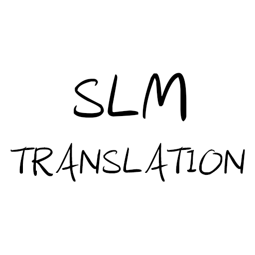

# SLM-Translation: Translation using SLM in VSCODE

[中文文档](README_ZH.md)

## How to use

-   **Enable plugin function**: Enter `SLM-Translation: Enable` in the command panel
-   **Disable plugin function**: Enter `SLM-Translation: Disable` in the command panel
-   **Translate selected text**: After selecting the text to be translated, press the shortcut key `shift` + `alt` + `t` or enter `SLM-Translation: Translate` in the command panel
-   **Name according to description**: After selecting the description text, press the shortcut key `shift` + `alt` + `n` or enter `SLM-Translation: Naming` in the command panel

## Requirements

Deploy `ollama` locally and pull the `qwen2.5:1.5b` model

> Currently it is a demo version, and only this model support is available for the time being

## Release Notes

### 0.0.1

The demo version implements the following core functions:

-   Translate selected text
-   Provide variables, functions, and class identifier suggestions based on the description
