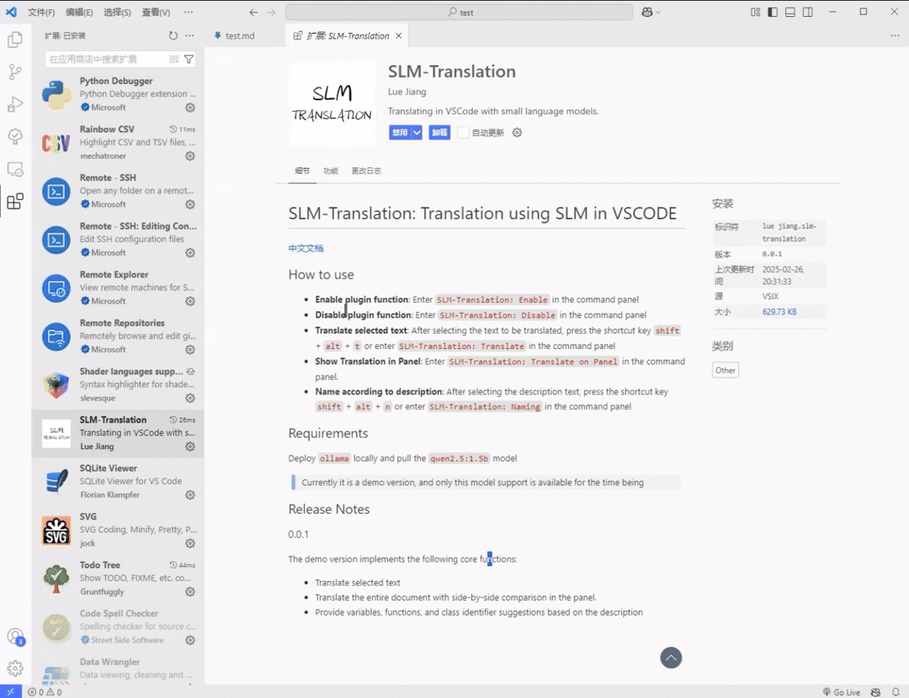

# SLM-Translation: 在 VSCODE 中使用 SLM 进行翻译

[English Docs](README_EN.md)

[Github 仓库](https://github.com/16-34/SLM-Translation)

## 如何使用

在确保配置正确后：

-   **悬停翻译**：选中待翻译文本后，将鼠标悬停在选中部分上
-   **选中翻译**：选中待翻译文本后，按下快捷键`shift` + `alt` + `t` 或在命令面板中输入`SLM-Translation: Translate`
-   **命名建议**：选中描述文本后，按下快捷键`shift` + `alt` + `n` 或在命令面板中输入`SLM-Translation: Naming`
-   **在面板中显示对照翻译**：在命令面板中输入`SLM-Translation: Translate on Panel`

| 命令                                        |                                  |
| ------------------------------------------- | -------------------------------- |
| `SLM-Translation: Enable  Hover Translate`  | 启用悬停翻译                     |
| `SLM-Translation: Disable  Hover Translate` | 禁用悬停翻译                     |
| `SLM-Translation: Translate`                | 翻译选中文本                     |
| `SLM-Translation: Translate on Panel`       | 在面板中显示当前活动文本对照翻译 |
| `SLM-Translation: Naming`                   | 根据描述（选中文本）提供命名建议 |
| `SLM-Translation: Clear Cache`              | 清除当前语言缓存                 |
| `SLM-Translation: Change Language`          | 切换目标语言                     |
| `SLM-Translation: Change Serve`             | 切换 LM 服务                     |
| `SLM-Translation: Change Model`             | 切换 LM 模型                     |

| 快捷键                |          |
| --------------------- | -------- |
| `shift` + `alt` + `t` | 选中翻译 |
| `shift` + `alt` + `n` | 命名建议 |

## 要求

code 版本 `>=1.90.0`
