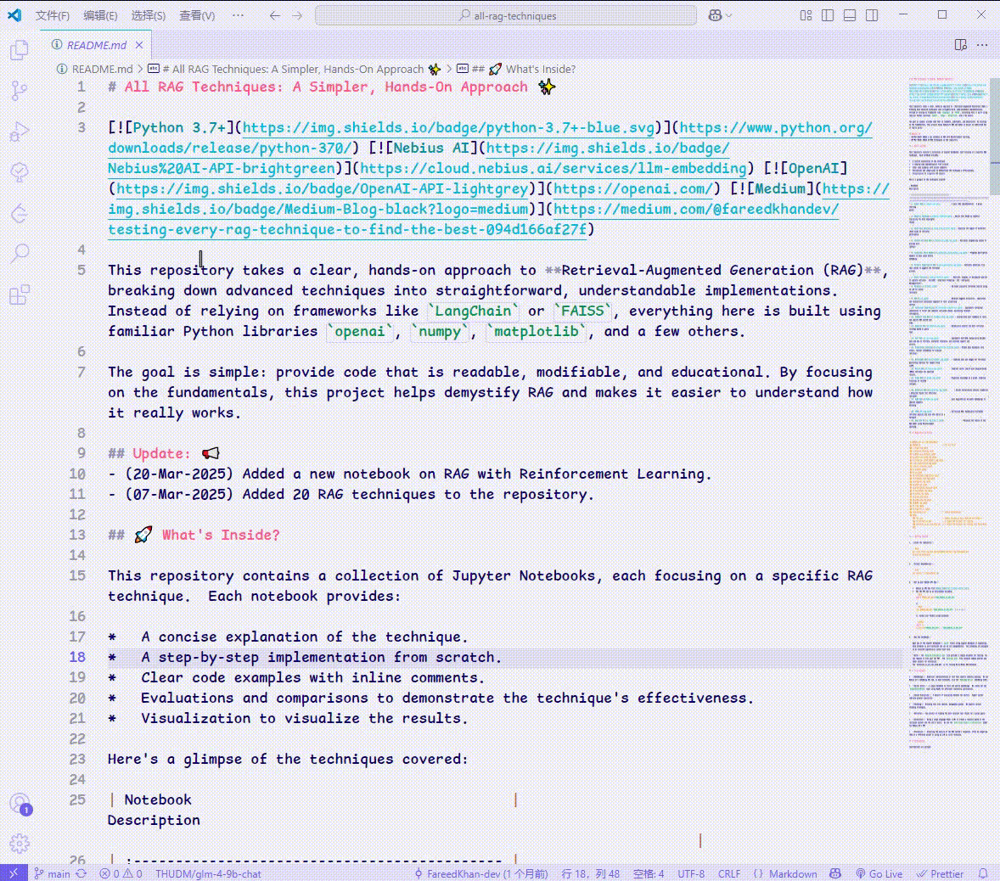
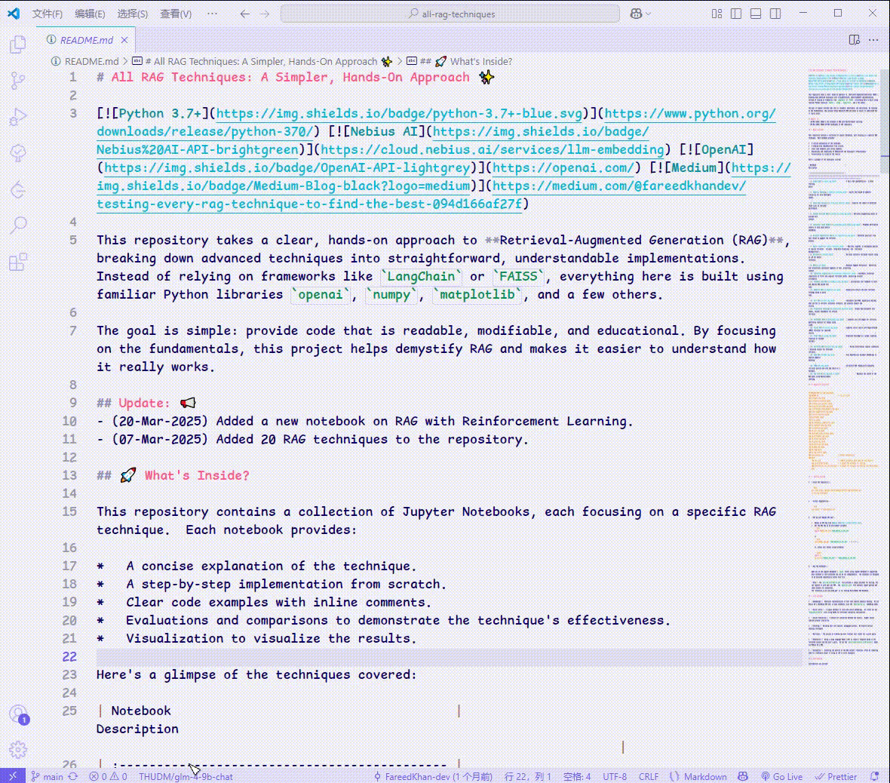
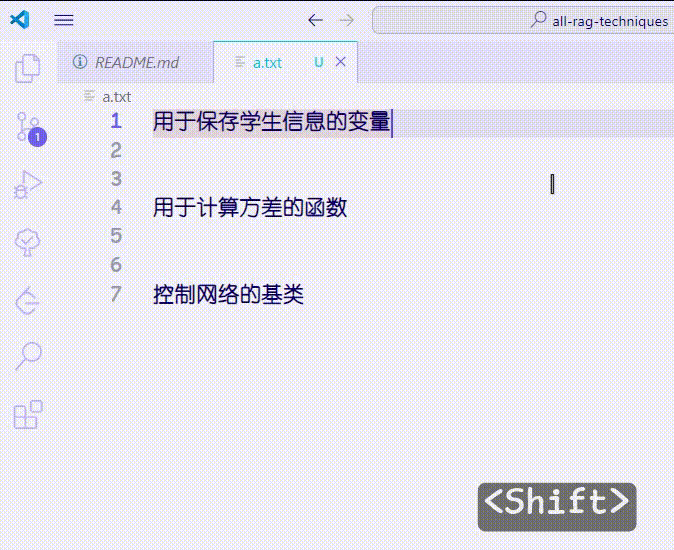
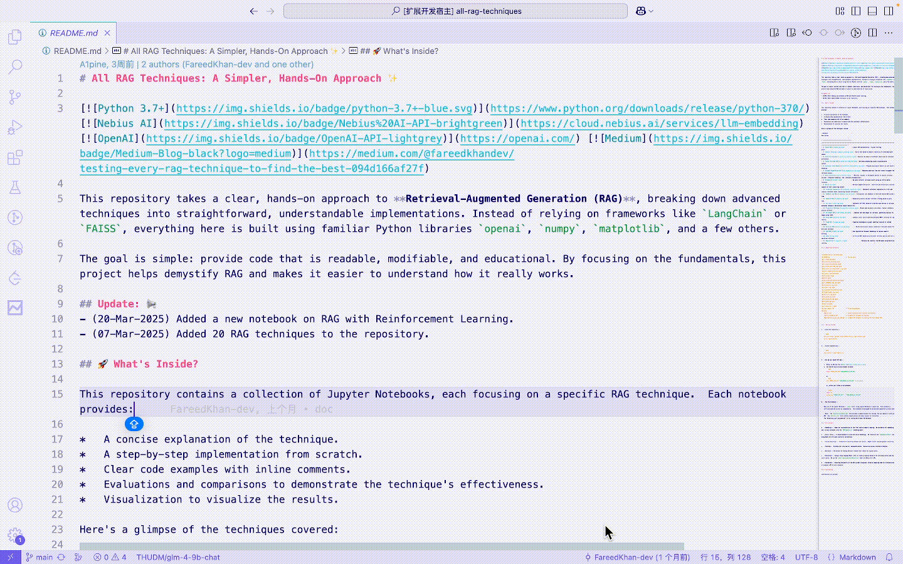

# SLM-Translation: Using SLM for Translation in VSCode

[Github Repository](https://github.com/16-34/SLM-Translation)

## How to Use

After ensuring that your configuration is correct:

-   **Hover Translation**: Select the text you want to translate, then hover your mouse over the selected part.
    
-   **Translate Selection**: Select the text you want to translate, then press the shortcut `shift` + `alt` + `t` or enter `SLM-Translation: Translate` in the command palette.
    
-   **Naming Suggestion**: Select the descriptive text, then press the shortcut `shift` + `alt` + `n` or enter `SLM-Translation: Naming` in the command palette.
    
-   **Show Translation in Panel**: Enter `SLM-Translation: Translate on Panel` in the command palette to display the translation of the active text in the panel.
    

| Command                                    |                                                                     |
| ------------------------------------------ | ------------------------------------------------------------------- |
| `SLM-Translation: Enable Hover Translate`  | Enable hover translation                                            |
| `SLM-Translation: Disable Hover Translate` | Disable hover translation                                           |
| `SLM-Translation: Translate`               | Translate the selected text                                         |
| `SLM-Translation: Translate on Panel`      | Display the translation of the active text in the panel             |
| `SLM-Translation: Naming`                  | Provide naming suggestions based on the selected text (description) |
| `SLM-Translation: Clear Cache`             | Clear the current language cache                                    |
| `SLM-Translation: Change Language`         | Switch the target language                                          |
| `SLM-Translation: Change Serve`            | Switch the LM serve                                                 |
| `SLM-Translation: Change Model`            | Switch the LM model                                                 |

| Shortcut              |                     |
| --------------------- | ------------------- |
| `shift` + `alt` + `t` | Translate Selection |
| `shift` + `alt` + `n` | Naming Suggestions  |

## Requirements

code version `>=1.90.0`
